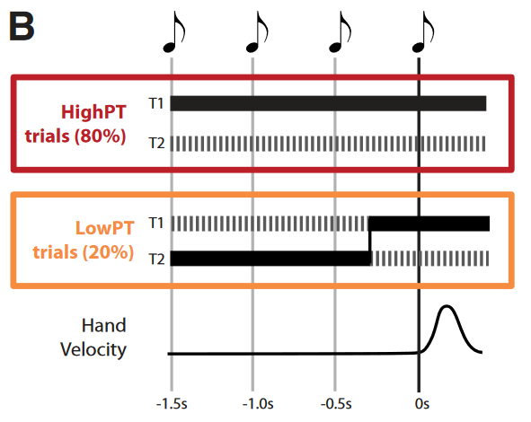
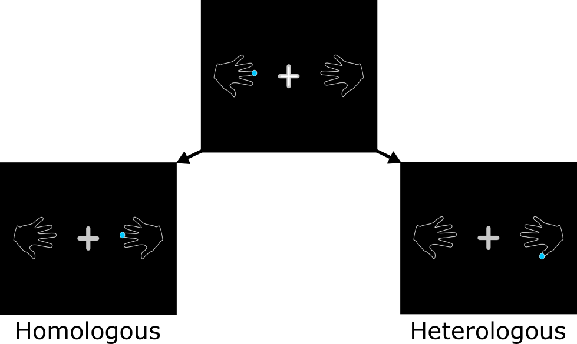

```{r setup, include=FALSE}
knitr::opts_chunk$set(echo = FALSE, warning = FALSE, message = FALSE,
                      fig.width = 10, fig.height = 5)
```

## Background
Homologous = Same finger, opposite hand

Heterologous = Different finger, opposite hand

Mirroring (Ejaz 2017)
 
 - Following stroke, see mirrored movement on non-paretic side
 - More mirroring (greater forces?) in homologous fingers

1. Planning on one finger primes movement in the homologous one
2. Planning on one finger *hinders* movement in the homologous one

## Experiment



 - Timed response (*a la* Haith 2015).
 
## Experiment


(+ Switching within the same hand)

## 

```{r import_clean}
library(data.table)
library(ggplot2)
library(brms)
theme_set(theme_minimal())

load('spline-model')

slider <- function(x, y, window_size = 0.1) {
  out <- rep(NA, length(y))
  upper <- x + (window_size/2)
  lower <- x - (window_size/2)
  
  for (nn in seq(1, length(y))) {
    out[nn] <- mean(y[x <= upper[nn] & x >= lower[nn]], na.rm = TRUE)
  }
  out
}

dat <-  fread('extended_data.csv') # comes from matlab file write_extended_data.m
dat <- dat[real_prep_time > 0]
dat <- dat[first_image != second_image]
dat <- dat[!is.nan(first_press)]
dat[, 'first_hand' := ifelse(first_image > 5, 'right', 'left')]
dat[, 'second_hand' := ifelse(second_image > 5, 'right', 'left')]

fings <- c('pinky', 'ring', 'middle', 'index', 'thumb')
fingers <- data.frame(first_image = 1:10, finger1 = c(fings, rev(fings)))
dat <- merge(dat, fingers, by = 'first_image', sort = FALSE)
names(fingers) <- c('second_image', 'finger2')
dat <- merge(dat, fingers, by = 'second_image', sort = FALSE)

dat[, 'label' := ifelse(first_hand == second_hand, 'same_hand',
                        ifelse(finger1 == finger2, 'homologous', 'heterologous'))]
names(dat)[17:18] <- c('first_finger', 'second_finger')

dat[, 'hand_chosen' := ifelse(first_press > 5, 'right', 'left')]
names(fingers) <- c('first_press', 'finger_chosen')
dat <- merge(dat, fingers, by = 'first_press', sort = FALSE)

dat[, 'slide_correct_group' := slider(real_prep_time, correct), by = c('label')]
dat[, 'slide_correct_id' := slider(real_prep_time, correct), by = c('label', 'id')]
# choice
dat[, 'chose_old' := first_image == first_press]
dat[, 'chose_new' := second_image == first_press]
dat[, 'chose_null' := chose_old == chose_new] # chose neither old nor new (one of the other choices)
dat[, 'hand_choice' := ifelse(first_press > 5, 'right', 'left')]
dat[, 'chose_null_old_hand' := chose_null & (hand_choice == first_hand)]
dat[, 'chose_null_new_hand' := chose_null & !chose_null_old_hand]

dat[, 'slide_old_group' := slider(real_prep_time, chose_old), by = c('label')]
dat[, 'slide_new_group' := slider(real_prep_time, chose_new), by = c('label')]
dat[, 'slide_null_group' := slider(real_prep_time, chose_null), by = c('label')]
dat[, 'slide_null_old_hand_group' := slider(real_prep_time, chose_null_old_hand), by = c('label')]
dat[, 'slide_null_new_hand_group' := slider(real_prep_time, chose_null_new_hand), by = c('label')]

dat[, 'slide_old_id' := slider(real_prep_time, chose_old), by = c('label', 'id')]
dat[, 'slide_new_id' := slider(real_prep_time, chose_new), by = c('label', 'id')]
dat[, 'slide_null_id' := slider(real_prep_time, chose_null), by = c('label', 'id')]
dat[, 'slide_null_old_hand_id' := slider(real_prep_time, chose_null_old_hand), by = c('label', 'id')]
dat[, 'slide_null_new_hand_id' := slider(real_prep_time, chose_null_new_hand), by = c('label', 'id')]
```

```{r correct_pop}
ggplot(dat, aes(x = real_prep_time, y = slide_correct_group, colour = label)) +
  geom_histogram(data = dat, aes(x = real_prep_time, y = ..density../10, colour = NULL),
                 bins = 50, alpha = 0.6) +
  geom_line(size = 1) + 
  xlim(c(0, 0.75)) +
  labs(x = 'Preparation Time (s)',
       y = 'Proportion Correct',
       title = 'Population-level correctness',
       subtitle = 'Histograms represent observation counts.')
```

## Switching to finger within same hand

```{r same_hand}
ggplot(dat[label == 'same_hand'], aes(x = real_prep_time, y = correct)) +
    geom_line(size = 1, aes(y = slide_old_group, colour = 'original (incorrect)')) +
    geom_line(size = 1, aes(y = slide_new_group, colour = 'same hand (correct)')) +
    geom_line(size = 1, aes(y = slide_null_old_hand_group, 
                            colour = 'choice on original hand (impossible)')) +
    geom_line(size = 1, aes(y = slide_null_new_hand_group,
                            colour = 'any finger on opposite hand (incorrect)')) +
    xlim(c(0, 0.75)) +
    labs(x = 'Preparation Time (s)',
         y = 'Proportion Choice') +
  guides(colour = guide_legend(title = 'choice'))

```

## Switching to heterologous finger

```{r heterologous}
ggplot(dat[label == 'heterologous'], aes(x = real_prep_time, y = correct)) +
    geom_line(size = 1, aes(y = slide_old_group, colour = 'original (incorrect)')) +
    geom_line(size = 1, aes(y = slide_new_group, colour = 'heterologous (correct)')) +
    geom_line(size = 1, aes(y = slide_null_old_hand_group, 
                            colour = 'same hand (incorrect)')) +
    geom_line(size = 1, aes(y = slide_null_new_hand_group,
                            colour = 'homologous (incorrect)')) +
    xlim(c(0, 0.75)) +
    labs(x = 'Preparation Time (s)',
         y = 'Proportion Choice') +
  guides(colour = guide_legend(title = 'choice'))

```

## Switching to homologous finger

```{r homologous}
ggplot(dat[label == 'homologous'], aes(x = real_prep_time, y = correct)) +
    geom_line(size = 1, aes(y = slide_old_group, colour = 'original (incorrect)')) +
    geom_line(size = 1, aes(y = slide_new_group, colour = 'homologous (correct)')) +
    geom_line(size = 1, aes(y = slide_null_old_hand_group, 
                            colour = 'same hand (incorrect)')) +
    geom_line(size = 1, aes(y = slide_null_new_hand_group,
                            colour = 'heterologous (incorrect)')) +
    xlim(c(0, 0.75)) +
    labs(x = 'Preparation Time (s)',
         y = 'Proportion Choice') +
  guides(colour = guide_legend(title = 'choice'))

```

## 

```{r}
ggplot(dat, aes(x = real_prep_time, y = correct)) +
    geom_line(data = dat[label == 'homologous'], size = 1,
              aes(x = real_prep_time, y = slide_null_new_hand_group,
                  colour = 'heterologous choice (from homologous switch)')) +
    geom_line(data = dat[label == 'heterologous'], size = 1,
              aes(x = real_prep_time, y = slide_null_new_hand_group,
                  colour = 'homologous choice (from heterologous switch)')) +
    xlim(c(0, 0.75)) +
    ylim(c(0, 1)) +
    labs(x = 'Preparation Time (s)',
         y = 'Proportion Choice') +
    guides(colour = guide_legend(title = 'choice'))
```

## Wobbly model

```{r}
data_heterologous <- data.frame(real_prep_time = seq(0, 0.75, 0.001),
                                label = 'heterologous')
fitted_het <- fitted(m1, newdata = data_heterologous, re_formula = NA)
data_heterologous <- cbind(data_heterologous, fitted_het[,,4])

data_homologous <- data.frame(real_prep_time = seq(0, 0.75, 0.001),
                                label = 'homologous')
fitted_hom <- fitted(m1, newdata = data_homologous, re_formula = NA)
data_homologous <- cbind(data_homologous, fitted_hom[,,4])

ggplot(data_heterologous, aes(x = real_prep_time, y = Estimate)) +
    geom_ribbon(aes(ymin = `2.5%ile`, ymax = `97.5%ile`,
                    fill = 'homologous choice (from heterologous switch)'),
    alpha = 0.4) +
    geom_line(aes(y = Estimate,
                  colour = 'homologous choice (from heterologous switch)'),
              size = 1) +
    geom_ribbon(data = data_homologous, aes(ymin = `2.5%ile`, ymax = `97.5%ile`,
                    fill = 'heterologous choice (from homologous switch)'),
    alpha = 0.4) +
    geom_line(data = data_homologous, aes(y = Estimate,
                  colour = 'heterologous choice (from homologous switch)'),
              size = 1) +
    ylim(c(0, 1)) +
    geom_line(data = dat[label == 'homologous'], size = 1,
              aes(x = real_prep_time, y = slide_null_new_hand_group,
                  colour = 'heterologous choice (from homologous switch)')) +
    geom_line(data = dat[label == 'heterologous'], size = 1,
              aes(x = real_prep_time, y = slide_null_new_hand_group,
                  colour = 'homologous choice (from heterologous switch)')) +
    labs(x = 'Preparation Time (s)',
         y = 'Proportion Choice')
    
```
